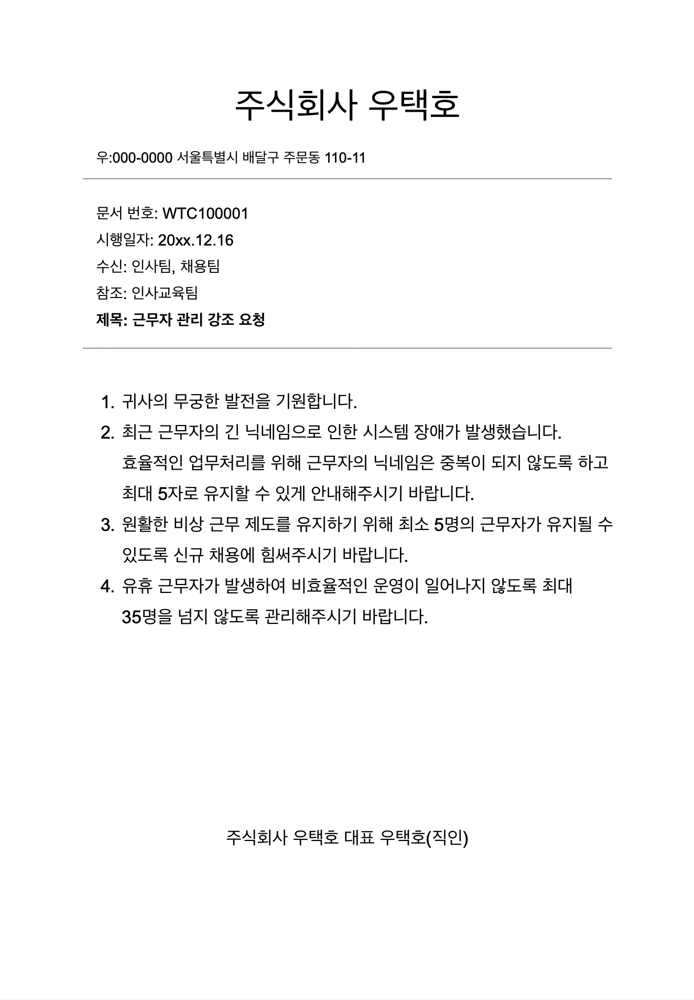

# 미션 - 개발자 비상근무

## 🚀 기능 요구 사항

### 비상 근무일 배정 규칙
- [ ] `순번에 따라` 비상 근무일 배정.
- [ ] 비상 근무자 평일 순번, 휴일 순번에 각각 1회 편성.
- [ ] 비상 근무자 연속 2일 근무 시 다음 근무자와 순서 바꿔 편성.
  ```
  목요일, 금요일(휴일) 연속으로 근무자 수아 -> 목요일 수아, 금요일 루루
  - 예시)
    - 평일 순번: 준팍,도밥,고니,수아,루루,글로,솔로스타,우코,슬링키,참새,도리
    - 휴일 순번: 수아,루루,글로,솔로스타,우코,슬링키,참새,도리,준팍,도밥,고니
    - 근무 예시: 준팍(월요일),도밥(화요일),고니(수요일),수아(목요일),루루(금요일/휴일),수아(토요일/휴일),...```
- 평일도 마찬가지
  ```
  평일도 마찬가지. 수요일(휴일), 목요일 수아 근무 -> 수요일 수아 근무, 목요일 루루 근무
  - 예시)
    - 평일 순번: 준팍,도밥,수아,루루,글로,솔로스타,우코,슬링키,참새,도리,고니
    - 휴일 순번: 수아,루루,글로,솔로스타,우코,슬링키,참새,도리,준팍,도밥,고니
    - 근무 예시: 준팍(월요일),도밥(화요일),수아(수요일/휴일),루루(목요일),수아(금요일),루루(토요일/휴일),글로(일요일/휴일),...```
- [ ] 순서를 여러번 바꿔야 하는 경우, 앞의 날짜부터 변경.
- [ ] 토, 일도 휴일로 따진다.

### 비상 근무자 배정 관련 참고 문서



### 입출력 요구 사항

- [ ] 해당 월(숫자)과 시작 요일(일, 월, 화, 수, 목, 금, 토) 정보 입력.
  - 매년 2월은 28일까지만 있다고 가정.
  ```
  비상 근무를 배정할 월과 시작 요일을 입력하세요> 5,월
  ```
- [ ] 평일 비상 근무 순서 입력.
  ```
  평일 비상 근무 순번대로 사원 닉네임을 입력하세요> 준팍,도밥,고니,수아,루루,글로,솔로스타,우코,슬링키,참새,도리
  ```
- [ ] 휴일(토요일, 일요일, 법정공휴일) 비상 근무 순서 입력.
  ```
  휴일 비상 근무 순번대로 사원 닉네임을 입력하세요> 수아,루루,글로,솔로스타,우코,슬링키,참새,도리,준팍,도밥,고니
  ```

### 예외 처리

- 올바르지 않은 입력 시 `[ERROR]`로 시작하는 에러 메시지 출력 후 다시 입력 받기.
- [ ] 비상 근무를 배정할 월과 시작 요일의 입력 값이 올바르지 않은 경우
  - 입력 형식 예외
  ```
  [ERROR] 유효하지 않은 입력 값입니다. 다시 입력해 주세요.
  ```
- [ ] 평일 순번 또는 휴일 순번의 입력 값이 올바르지 않은 경우
  - 입력 형식 예외
  - 5글자 초과 예외
  - 사원이 평일, 휴일 순번 입력에 각각 1회씩 작성되지 않은 경우
    - 중복 예외
    - 닉네임이 평일에만 있거나 휴일에만 있는 경우
  - 최소 5명
  - 최대 35명
  ```
  [ERROR] 유효하지 않은 입력 값입니다. 다시 입력해 주세요.
  ```

### 출력 요구 사항

- [ ] 평일이면서 법정공휴일일 시 요일 뒤에 (휴일) 표기.
  - 평일인지 어떻게 판단할 것인가 -> 몇월 몇일이 무슨 요일인지 파악되므로 이대로 실행.
  - 법정공휴일 목록
    - 1월 1일
    - 3월 1일
    - 5월 5일
    - 6월 6일
    - 8월 15일
    - 10월 3일
    - 10월 9일
    - 12월 25일
- [ ] 비상 근무표 출력 완료 시 프로그램 종료.

```
5월 1일 월 준팍
5월 2일 화 도밥
5월 3일 수 고니
5월 4일 목 수아
5월 5일 금(휴일) 루루
5월 6일 토 수아
5월 7일 일 글로
5월 8일 월 루루
5월 9일 화 글로
5월 10일 수 솔로스타
5월 11일 목 우코
5월 12일 금 슬링키
5월 13일 토 솔로스타
5월 14일 일 우코
5월 15일 월 참새
5월 16일 화 도리
5월 17일 수 준팍
5월 18일 목 도밥
5월 19일 금 고니
5월 20일 토 슬링키
5월 21일 일 참새
5월 22일 월 수아
5월 23일 화 루루
5월 24일 수 글로
5월 25일 목 솔로스타
5월 26일 금 우코
5월 27일 토 도리
5월 28일 일 준팍
5월 29일 월 슬링키
5월 30일 화 참새
5월 31일 수 도리
```

### 예시
```
비상 근무를 배정할 월과 시작 요일을 입력하세요> 5,월
평일 비상 근무 순번대로 사원 닉네임을 입력하세요> 준팍,도밥,고니,수아,루루,글로,솔로스타,우코,슬링키,참새,도리
휴일 비상 근무 순번대로 사원 닉네임을 입력하세요> 수아,루루,글로,솔로스타,우코,슬링키,참새,도리,준팍,도밥,고니

5월 1일 월 준팍
5월 2일 화 도밥
5월 3일 수 고니
5월 4일 목 수아
...
```

---

### 라이브러리

- `camp.nextstep.edu.missionutils`에서 제공하는 `Console` API를 사용하여 구현해야 한다.
    - 사용자가 입력하는 값은 `camp.nextstep.edu.missionutils.Console`의 `readLine()`을 활용한다.
